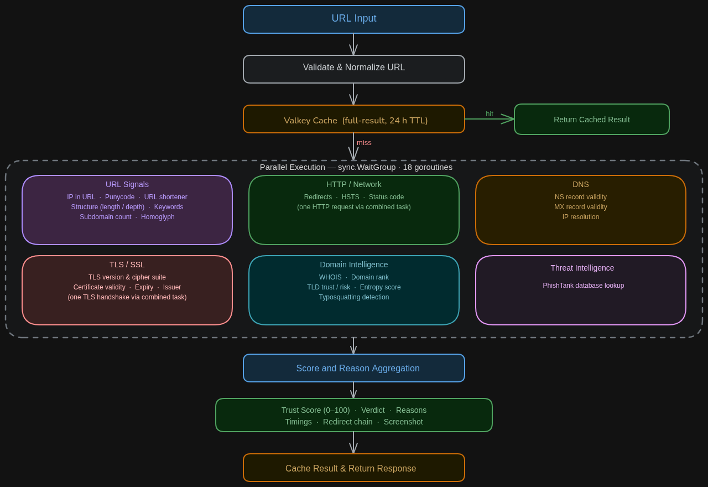
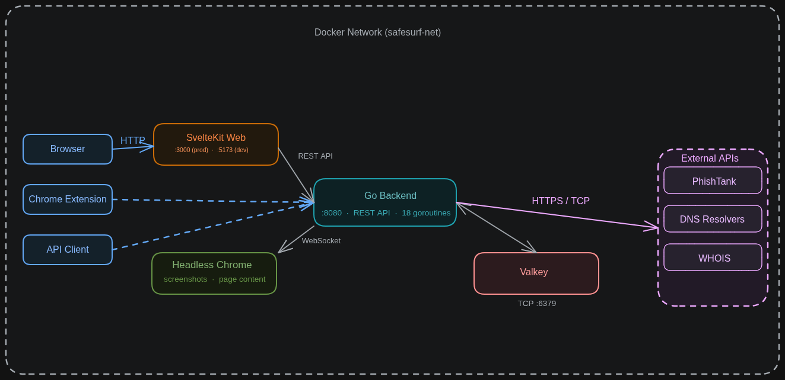

<div align="center">

# url.vet

**some link looks sus? just url.vet it.**

Open-source phishing detection engine — paste any URL and get a trust score, a fully explainable verdict, and a shareable security report with live page preview, all in real time.

[](https://go.dev)
[](https://svelte.dev)
[](LICENSE)
[](https://github.com/abhizaik/urlvet)
[](https://github.com/abhizaik/urlvet/commits/main)

[⚡ Quick Start](#quick-start) · [⚙️ Detection Engine](#detection-engine) · [🏛 Architecture](#architecture) · [📚 Docs](#documentation) · [🤝 Contributing](#contributing)

<sub>(Previously known as SafeSurf)</sub>

</div>

---

## Phishing Detection Demo

 > Paste a URL → get a **trust score, verdict, and detailed report** in real time.


Live demo: https://url.vet


## Quick Start

```bash
git clone https://github.com/abhizaik/urlvet.git
cd urlvet
make start
```

Open Web UI: **[localhost:3000](http://localhost:3000)** 

Detailed setup guide: [docs/setup.md](docs/setup.md) 


## At a Glance

- Live scan, instant results
- 18 analyzers, 33 signals, fully explainable
- HTTP API + Web UI + Chrome extension
- Explainable scoring (no black-box ML)
- Simple Docker setup


## How It Compares

| Feature | url.vet | VirusTotal | Google Safe Browsing | URLScan.io | CheckPhish |
|---------|----------|------------|----------------------|------------|------------|
| Live crawl, instant results | ✅ | Partial | ❌ | Partial | Partial |
| Explains every verdict | ✅ | Partial | ❌ | Partial | Partial |
| Beginner-friendly interface | ✅ | Partial | Partial | Partial | Partial |
| Credential form detection | ✅ | ❌ | ❌ | Partial | ✅ |
| Follows redirect chains | ✅ | ✅ | ❌ | ✅ | ✅ |
| Detailed technical insights | ✅ | ❌ | ❌ | ✅ | Partial |
| Live page preview | ✅ | ❌ | ❌ | ✅ | ✅ |
| Detection using AI/ML | ❌ | ✅ | ✅ | Partial | ✅ |
| Known phishing database coverage | Partial | ✅ | ✅ | Partial | Partial |
| Scan multiple URLs at once | ❌ | ✅ | ✅ | ✅ | ❌ |
| Browser protection | ✅ | ✅ | ✅ | ✅ | ❌ |
| Open source | ✅ | ❌ | ❌ | ❌ | ❌ |

Fast scanners (like Google Safe Browsing) give you a verdict from database lookup with no explanation or live scanning. Deep crawlers (like URLScan.io) take too long. url.vet bridges the gap by doing live analysis with per-signal explanations in real time — and it's open-source.


## Who This Is For

- End users checking suspicious links
- Developers integrating URL analysis
- Security teams building detection pipelines
- Researchers


## API Example

Analyze a URL via HTTP:

```bash
curl "http://localhost:8080/api/v1/analyze?url=https://example.com"
```
**Sample Response:**
<pre><code class="language-json">
{
  "url": "https://example.com",
  "trust_score": 100,
  "verdict": "Safe",
  "reasons": {
    "good_reasons": [...]
  }
}
</code></pre>
Full response schema → [docs/api.md#example](docs/api.md#example) 

## Detection Engine

**18 concurrent goroutines** run across **7 signal categories**, producing **33 individual signals**. Every check emits a reason string — good, bad, or neutral — so the final score is always fully explainable. No black-box verdicts.

Score formula: `finalScore = clamp(50 + (trustScore − riskScore) × 0.5)` → **Risky** < 30 · **Suspicious** 30–64 · **Safe** ≥ 65

> 50 is the neutral baseline — a URL with no signals scores exactly 50 (Suspicious), the right default for an unknown URL. Trust signals pull the score up, risk signals pull it down, each weighted at 0.5× so neither dominates alone. Both scores are individually clamped to 0–100 before the formula runs, preventing a single catastrophic signal from drowning all other context.

**URL Signals** _(8 checks)_

1. Raw IP address as hostname _(common evasion tactic)_
2. Punycode / IDN encoding _(lookalike domain spoofing)_
3. URL shortener _(hides the true destination)_
4. Excessive URL length _(abnormally long URLs used to hide destination or confuse parsers)_
5. Excessive URL path depth _(deeply nested paths used to obscure malicious endpoints)_
6. Phishing keywords in URL path _(login, verify, secure, update…)_
7. Excessive subdomain count
8. Non-ASCII Unicode characters in hostname _(IDN homograph attack, e.g. аpple.com with Cyrillic а)_

**HTTP / Network** _(4 checks, single HTTP request)_

9. Redirect chain hop count
10. Cross-domain redirect _(final destination differs from source domain)_
11. HSTS support
12. HTTP status code

**DNS** _(3 checks)_

13. NS record validity
14. MX record validity
15. IP resolution

**TLS / SSL** _(2 checks, single TLS handshake)_

16. TLS presence and hostname mismatch
17. Certificate chain — validity, expiry, issuer, CT log status, known-bad fingerprints

**Domain Intelligence** _(6 checks)_

18. Domain rank _(position in top-1M global popularity list)_
19. TLD trust / risk / ICANN status
20. Domain age via WHOIS _(newly registered = high risk)_
21. DNSSEC _(cryptographic DNS response integrity)_
22. Shannon entropy score _(flags algorithmically generated domains)_
23. Typosquatting & combo-squatting across 500+ known brands

**Content Analysis** _(8 checks)_

24. Login form on unranked or newly registered domain
25. Payment form _(credit card, CVV fields)_
26. Personal information form
27. Hidden `<iframe>` _(credential theft / clickjacking vector)_
28. Tracking pixels _(1×1 hidden images)_
29. Brand name in page content vs. hosting domain
30. Form submitting to an external domain
31. Password field over unencrypted HTTP

**Threat Intelligence** _(2 checks)_

32. PhishTank confirmed phishing _(community-verified)_
33. PhishTank reported phishing _(awaiting verification, 3 h cache)_




## Limitations
- Heuristic-based detection may produce false positives
- No ML model (intentional, prioritizes explainability and auditability)

Not a safety guarantee. Use alongside other defenses.


## Architecture

Four containerized services on a shared Docker bridge network. The Go backend is the only service that makes outbound calls to external APIs — the frontend, Chrome, and cache are strictly internal.



| Service | Role |
|---|---|
| `urlvet-web` | SvelteKit UI — :3000 (prod) · :5173 (dev) |
| `urlvet-backend` | Go REST API & analyzer engine — :8080 |
| `urlvet-chrome` | Headless Chrome — WebSocket :9222 |
| `urlvet-valkey` | Valkey (Redis-compatible) — :6379, LRU cache, volume-persisted |

### Request lifecycle
1. URL submitted via the UI or REST API
2. Backend validates and normalizes the URL (scheme inferred if missing)
3. Valkey cache checked — a hit returns the full result immediately, no re-analysis
4. On miss: 18 goroutines launch concurrently via `sync.WaitGroup`; panics are recovered per-task without failing the request
5. Results collected → score aggregated → verdict assigned
6. Complete result cached in Valkey (24 h TTL) and logged to scan history
7. Response returned — trust score, verdict, per-signal reasons, redirect chain, page screenshot, per-task timings

```text
server/
  cmd/urlvet/         entry point
  internal/analyzer/    goroutine runner, task definitions, score aggregation
  internal/service/
    checks/             18 individual analyzer implementations
    screenshot/         headless Chrome integration
    cache/              Valkey client
    threatfeeds/        PhishTank client
    typosquat/          brand similarity engine
web/website/            SvelteKit UI
web/chrome-extension/   browser extension
docker/                 dev & prod Compose configs
docs/                   API, setup, architecture, security
```


## Documentation

| | |
|---|---|
| [Setup](docs/setup.md) | Local & Docker setup, Makefile commands |
| [Configuration](docs/configuration.md) | All environment variables |
| [Deployment](docs/deployment.md) | VPS, reverse proxy, firewall |
| [API Reference](docs/api.md) | Endpoints, rate limits, example response |
| [Architecture](docs/architecture.md) | Services, request lifecycle, detection engine |
| [Security](docs/security.md) | Admin auth, password hashing |
| [Performance](docs/performance.md) | Latency, resource usage, tuning |
| [Design Decisions](docs/design-decisions.md) | Why things are built the way they are |
| [Maintenance](docs/maintenance.md) | Cache, logs, backups |
| [Glossary](docs/glossary.md) | Terms and acronyms |

Interactive API docs (Swagger UI): [api.url.vet/swagger/index.html](https://api.url.vet/swagger/index.html)


## Citation

If you use this project in academic or research work, please cite it — see [CITATION.cff](CITATION.cff).

## License

Copyright (C) 2023–2026 Abhishek K P

url.vet is dual-licensed:

- **Community** — [GNU Affero General Public License v3.0](LICENSE). Free to use, modify, and self-host. Any modified version run over a network must make its source code available to users.
- **Commercial** — A separate [commercial license](COMMERCIAL.md) is available for organizations that cannot comply with the AGPL-3.0 (e.g. closed-source SaaS).


## Contributing

- Found a bug? → [Open an issue](https://github.com/abhizaik/urlvet/issues)
- Have a question or idea? → [Start a discussion](https://github.com/abhizaik/urlvet/discussions)
- Want to contribute code? → [CONTRIBUTING.md](.github/CONTRIBUTING.md)

If you found this project helpful, consider giving it a star.


<!-- <div align="center">
  <a href="https://star-history.com/#abhizaik/urlvet&Date">
    <picture>
      <source media="(prefers-color-scheme: dark)" srcset="https://api.star-history.com/svg?repos=abhizaik/urlvet&type=Date&theme=dark" />
      <source media="(prefers-color-scheme: light)" srcset="https://api.star-history.com/svg?repos=abhizaik/urlvet&type=Date" />
      
    </picture>
  </a>
</div> -->

